  

  
  

  
  
  

<h3 align="left">Skills and Tools</h3>

  
  
  
  

  
  
  

  
  
  

  
  
  
  
  

<h3 align="left">Projects</h3>

| Project | Description | Stack |
| --- | --- | --- |
| [Habit Tracking App](https://github.com/Developer-shivamMishra/Habit-tracking-app) | Track daily habits and stay consistent | CSS, HTML, JavaScript |
| [Photo Gallery App](https://github.com/Developer-shivamMishra/Photo-gallery-app) | Interactive photo gallery with smooth UI | JavaScript |
| [Form Validation](https://github.com/Developer-shivamMishra/Form-Validation) | Client-side form validation patterns | JavaScript |

